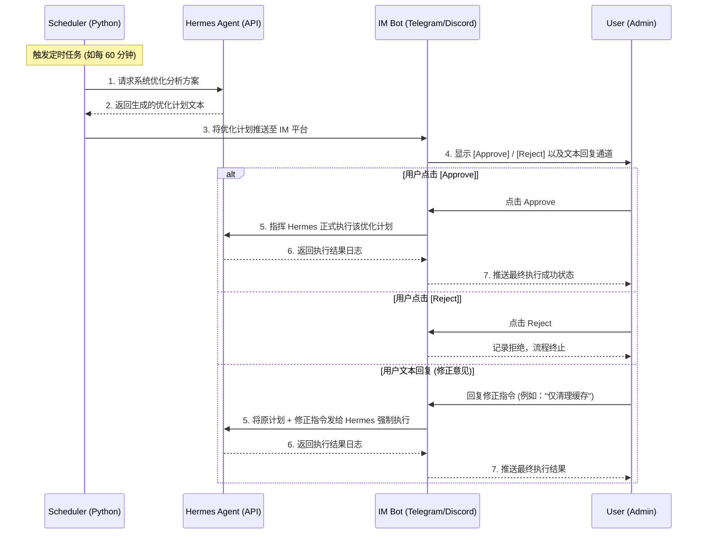

# Hermes Auto-Builder: 自动化与人工审核系统设计文档

## 1. 系统概述与目标

**Hermes Auto-Builder** 是一个后台常驻调度系统，旨在打通云端自动化运维与人类审核的闭环。
系统的核心目标是：实现对系统的 24 小时监控与自动优化建议生成（基于 Hermes Agent），但在执行任何高风险或实质性的变更前，必须通过即时通讯工具（IM）引入**“人在回路 (Human-in-the-loop)”**机制进行审核与拦截。

---

## 2. 系统架构

系统分为四个主要物理与逻辑层级：

1. **定时调度层 (Scheduler)**：驱动整个系统的引擎，根据时间或事件状态触发。
2. **AI 分析层 (Hermes API)**：负责接受诊断请求，输出具体的优化策略（方案生成）。
3. **IM 交互层 (Bot Listener)**：作为通知与人工控制终端。
4. **执行层 (Hermes Execution)**：在获取人类显式授权后，正式执行策略。

---

## 3. 核心模块设计

### 3.1 调度器模块 (Scheduler)
* **技术选型**：`schedule` + `asyncio`
* **功能描述**：
  在后台死循环中运行，不阻塞其他异步任务。到达预定的触发条件（如每小时）后，拉起 `API` 模块的诊断请求。

### 3.2 AI 交互模块 (Hermes API Handler)
* **技术选型**：`aiohttp` 或 `requests`
* **功能描述**：
  封装对 Hermes Agent 的 RESTful API / WebSocket 调用。
  包含两个核心接口：
  - `get_plan()`: 输入 Prompt 请求状态检测和计划生成（Temperature 偏低，要求客观分析）。
  - `execute_action()`: 输入显式的执行授权，或者附加人工给予的 Constraint（约束条件）。

### 3.3 即时通讯机器人 (IM Bot)
* **技术选型**：`python-telegram-bot` (或其他平台 SDK)
* **功能描述**：
  利用 Inline Keyboard 提供 UI 界面，接收 Webhook 或长轮询（Polling）。
  维护当前审核状态的上下文，防止用户重复点击或错误授权。

---

## 4. 技术栈与环境依赖

* **主语言**：Python 3.11+
* **依赖库**：
  - 核心逻辑：`schedule`, `asyncio`
  - 网络请求：`aiohttp`, `requests`
  - 环境配置：`python-dotenv`
  - IM SDK：`python-telegram-bot` (可替换)
* **部署方式**：
  - 采用 Docker 容器化打包 (`Dockerfile` + `docker-compose.yml`)。
  - 使用 `restart: always` 策略确保云服务器重启或发生 Panic 时服务自愈。

---

## 5. 安全与权限考量

> [!CAUTION]
> **安全机制设计**
>
> 1. **认证隔离**：IM 机器人必须校验 `CHAT_ID`，忽略非授权用户的任何指令和点击。
> 2. **执行隔离**：Hermes 的默认状态必须设定为“规划模式”，彻底切断它在获取明确“执行”指令前的副作用权限。
> 3. **网络安全**：如果 Hermes 和 Auto-builder 跑在同一台云服务器，API 调用走 `localhost` 闭环，避免端口对外暴露。

---

## 6. 未来扩展 (Future Roadmap)

* **事件驱动触发**：除了定时任务外，未来可以引入 Prometheus/Node_exporter 探针，当内存使用率突破 85% 时主动发送报警及优化建议。
* **审核历史记录**：将所有的优化计划和用户的审核记录写入 SQLite 数据库，方便溯源排查系统故障。
